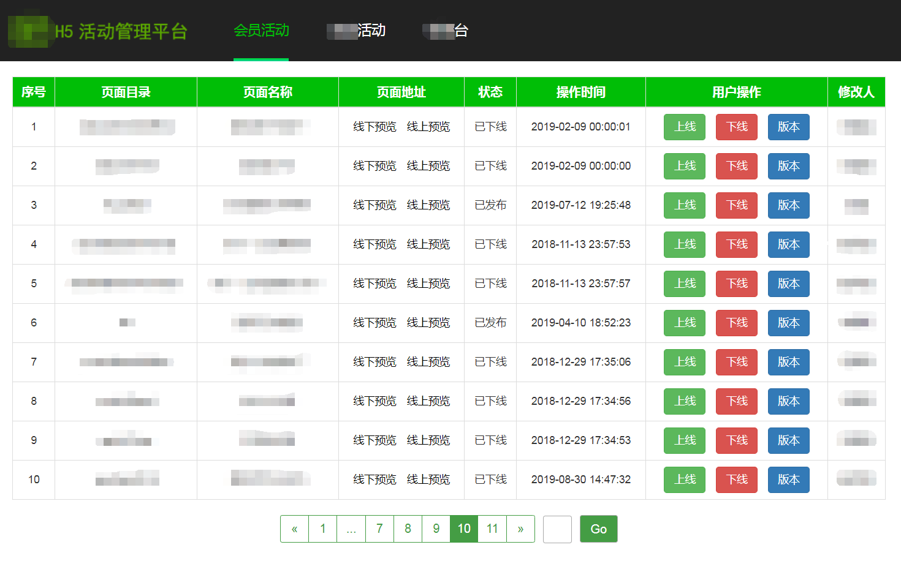
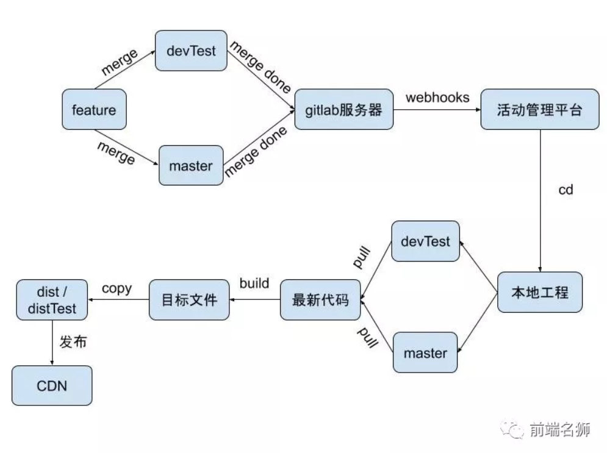
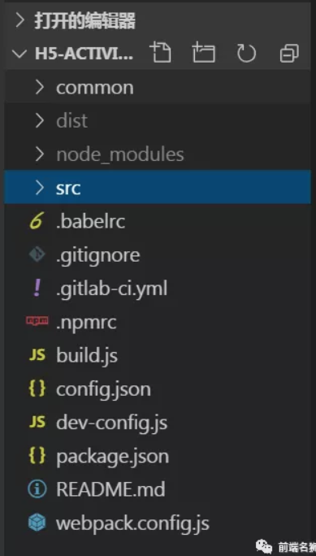
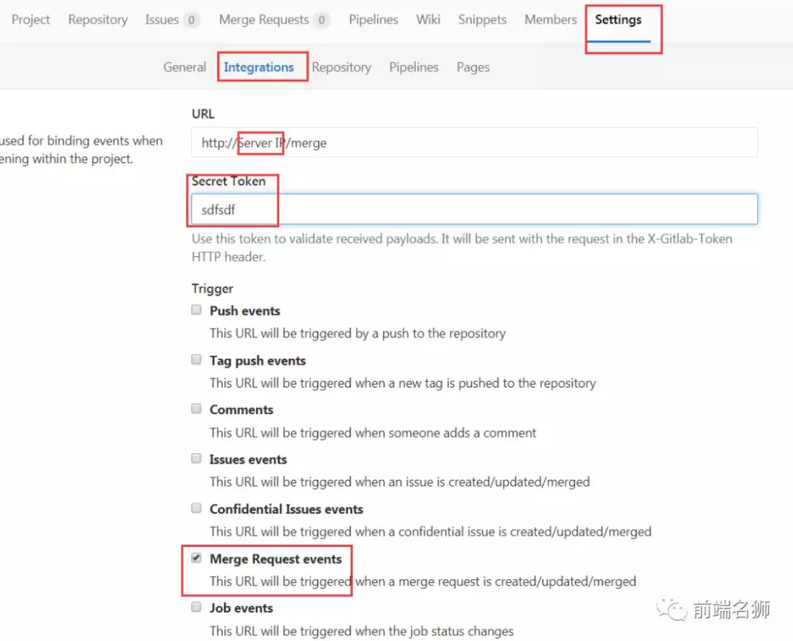
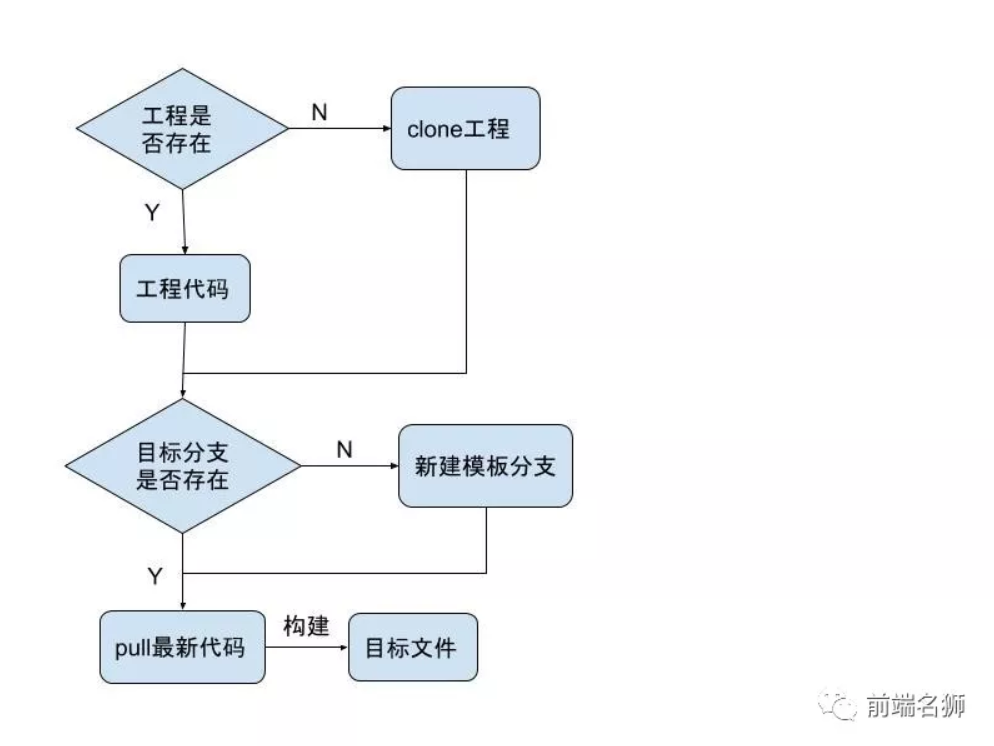

# 抛弃jenkins，如何用node从零搭建自动化部署管理平台

## 一、背景

H5页面由于其具有发布灵活、跨平台、易于传播等突出特点，所以H5页面是引流拉新、宣传推广的重要渠道和方式，备受各公司的青睐。

小编的日常工作就是做各种面向用户的H5促销活动的开发，在整个开发周期中，接合我司的一些情况，我总结了H5活动页面的以下特点：


1. 面向用户，流量大；
2. 各端展示方案不同，需要兼容各端（比如活动规则、展示模块，ios和android不一样）；
3. 需求变更频繁；
4. 合作方较多（需要跟各个业务线合作联调）；
5. 排期紧张；

**所以开发测试期间，部署效率就显得特别重要了。**

由于我司的CDN发布平台，需要手动创建模板、粘贴代码，部署效率比较低下；并且活动页面代码分散，无法统一管理和实现工程化，所以决定实现一套自动化部署系统，目前已经投入使用半年时间了，极大地提高了我们的工作效率。**我称这个自动化部署系统为【H5 活动管理平台】**。


## 二、H5 活动管理平台自动化部署实现方案

介绍该平台实现方案之前，先放张效果图，好有一个直观的认识。



该平台实现主要依赖于**本地开发工程**、**gitlab**，三者之间通过通信交互，实现的自动化部署。


**最终达到的效果就是：当本地开发分支merge到测试分支devTest或者master分支时，该平台会自动拉取最新代码，构建目标文件，然后将目标文件部署到对应的服务器目录，另外提供了上下线、版本回滚、定时上下线等常用功能。**


**整体架构流程图：**




下面对一些关键技术点进行详细介绍

### 1. 本地开发工程

我们的本地开发工程，是使用`node + webpack + babel`等相关技术搭建的多页面开发工程，不同的活动位于不同的目录。因为要做自动化构建部署处理，跟【H5活动管理平台】交互，所以有以下要点需要注意（可根据自己项目情况，自由调整方案）。

1. 本地开发工程作为自动化构建部署的源头，需要提供构建命令行用于构建测试文件和线上文件，便于后面shell命令调用。如在`package.json`中加入如下命令：

```js
"scripts": {
    "local": "cross-env NODE_ENV=local node build.js", // 本地开发命令
    "build": "cross-env NODE_ENV=product node build.js", // 构建上线文件
    "test": "cross-env NODE_ENV=test node build.js" // 构建测试文件
}
```

2. 提供构建配置文件`dev-config.js`，用于过滤`webpack`构建时的入口目录，只构建编译当前正在开发的活动页面，提高构建速度。

```js
//dev-config.js
module.exports = {
    devPages: ['test']   //  当前自己正在开发页面目录，不写时会编译所有活动页面
}
```
3. 提供活动页面目录信息配置`config.json`，该配置信息用于【H5活动管理平台】的展示，也就是效果图中的信息源。

```js
// config.json
{
  "pages": [
        {
            "folder": "lion",
            "desc": "前端名狮",
            "author": "诀九",
            "user": "juejiu"
        },
        {
            "folder": "test",
            "desc": "活动测试页面",
            "author": "诀九",
            "user": "juejiu"
        }
    ]
}
    
```
4. 构建生成的 `JS` 和 `HTML` 文件，存放在 `dist` 目录下的对应活动目录中。构建生成的目录结构如下：

```js
|--dist
   |-- lion
       |-- lion_app.js
       |-- index.html
   |--test
       |-- test_app.js
       |-- index.html

```
5. 提测时，将开发分支merge到devTest分支，上线时，将开发分支merge到master分支。





### 2. gitlab服务器

`Gitlab`作为企业代码版本管理工具，提供了`Webhook`的功能配置，`Webhook`顾名思义，其实就是一钩子。当我们在`Gitlab`上做出某些特定操作时，可以触发钩子，去进行一些我们事先设定好的脚本，以达到某些特定功能（例如--前端项目自动发布）。

实际上可以把它理解为回调，或者委托，或者事件通知，归根揭底它就是一个消息通知机制。**当gitlab触发某个事件时，它会向你的所配置的http服务发送Post请求**。

**注意：**
1. URL处填写的是【H5活动管理平台】部署的服务器IP;
2. IP后面跟的`merge`是该平台提供的一个接口，用于触发钩子后，gitlab服务器向这个接口发送Post请求；
3. `Secret Token`处填写的是一个token，主要用于merge接口请求做安全校验，可以随便设置。

具体配置如下图：



我们项目是设置的merge钩子，下面只贴一下`Merge request events`请求传递的数据信息：

**Request header:**
```
X-Gitlab-Event: Merge Request Hook
```

**Request body:**

```js
{
  "object_kind": "merge_request",
  "user": {
    "name": "Administrator",
    "username": "root",
    "avatar_url": "http://www.gravatar.com/avatar/e64c7d89f26bd1972efa854d13d7dd61?s=40\u0026d=identicon"
  },
  "object_attributes": {
    "id": 99,
    "target_branch": "master",
    "source_branch": "ms-viewport",
    "source_project_id": 14,
    "author_id": 51,
    "assignee_id": 6,
    "title": "MS-Viewport",
    "created_at": "2013-12-03T17:23:34Z",
    "updated_at": "2013-12-03T17:23:34Z",
    "st_commits": null,
    "st_diffs": null,
    "milestone_id": null,
    "state": "opened",
    "merge_status": "unchecked",
    "target_project_id": 14,
    "iid": 1,
    "description": "",
    "source":{
      "name":"Awesome Project",
      "description":"Aut reprehenderit ut est.",
      "web_url":"http://example.com/awesome_space/awesome_project",
      "avatar_url":null,
      "git_ssh_url":"git@example.com:awesome_space/awesome_project.git",
      "git_http_url":"http://example.com/awesome_space/awesome_project.git",
      "namespace":"Awesome Space",
      "visibility_level":20,
      "path_with_namespace":"awesome_space/awesome_project",
      "default_branch":"master",
      "homepage":"http://example.com/awesome_space/awesome_project",
      "url":"http://example.com/awesome_space/awesome_project.git",
      "ssh_url":"git@example.com:awesome_space/awesome_project.git",
      "http_url":"http://example.com/awesome_space/awesome_project.git"
    },
    "target": {
      "name":"Awesome Project",
      "description":"Aut reprehenderit ut est.",
      "web_url":"http://example.com/awesome_space/awesome_project",
      "avatar_url":null,
      "git_ssh_url":"git@example.com:awesome_space/awesome_project.git",
      "git_http_url":"http://example.com/awesome_space/awesome_project.git",
      "namespace":"Awesome Space",
      "visibility_level":20,
      "path_with_namespace":"awesome_space/awesome_project",
      "default_branch":"master",
      "homepage":"http://example.com/awesome_space/awesome_project",
      "url":"http://example.com/awesome_space/awesome_project.git",
      "ssh_url":"git@example.com:awesome_space/awesome_project.git",
      "http_url":"http://example.com/awesome_space/awesome_project.git"
    },
    "last_commit": {
      "id": "da1560886d4f094c3e6c9ef40349f7d38b5d27d7",
      "message": "fixed readme",
      "timestamp": "2012-01-03T23:36:29+02:00",
      "url": "http://example.com/awesome_space/awesome_project/commits/da1560886d4f094c3e6c9ef40349f7d38b5d27d7",
      "author": {
        "name": "GitLab dev user",
        "email": "gitlabdev@dv6700.(none)"
      }
    },
    "work_in_progress": false,
    "url": "http://example.com/diaspora/merge_requests/1",
    "action": "open",
    "assignee": {
      "name": "User1",
      "username": "user1",
      "avatar_url": "http://www.gravatar.com/avatar/e64c7d89f26bd1972efa854d13d7dd61?s=40\u0026d=identicon"
    }
  }
}

```

### 3. H5 活动管理平台

当开发者merge代码到GitLab服务器，会触发merge事件，GitLab会发送一个POST请求连带数据（数据格式）给webhooks指定的URL，该平台接收到URL请求后，就涉及如下关键技术点：

**1. 根据post请求头信息和和body数据，我们能得到如下信息：**
 
merge的目标分支： `req.body.object_attributes.target_branch`；

安全校验token：`req.headers['x-gitlab-token']`；

gitlab工程仓库地址：`req.body.project.git_ssh_url`

触发的钩子行为类型：`req.body.object_attributes.action`

```
// gitlab触发merge请求
router.post('/merge', function (req, res, next) {
    let git_ssh_url = req.body.project.git_ssh_url;
    let name = req.body.project.name;
    // 上线merge分支master
    if (req.headers['x-gitlab-token'] == 'mergeRequest' && req.body.object_attributes.target_branch == 'master' && req.body.object_attributes.action == 'merge') {
        if (config[name] && config[name].git_ssh_url == git_ssh_url) {
            mergeTaskQueue.addTask(function () {
                getCode.init(git_ssh_url, name, 'master').then(function (data) {
                    console.log(data);
                    mergeTaskQueue.run();
                }).catch(function (error) {
                    console.log(error);
                    mergeTaskQueue.run();
                })
            }.bind(null, git_ssh_url, name));
        }
        res.end('receive request');
        // 测试merge分支dev
    } else if (req.headers['x-gitlab-token'] == 'mergeRequest' && req.body.object_attributes.target_branch == config[name].testEnv.targetBranch && req.body.object_attributes.action == 'merge') {
        if (config[name] && config[name].git_ssh_url == git_ssh_url) {
            mergeTaskQueue.addTask(function () {
                getCode.init(git_ssh_url, name, req.body.object_attributes.target_branch).then(function (data) {
                    console.log(data);
                    mergeTaskQueue.run();
                }).catch(function (error) {
                    console.log(error);
                    mergeTaskQueue.run();
                })
            }.bind(null, git_ssh_url, name));
        }
        res.end('receive request');
    } else {
        return res.end('receive request');
    }
})
```

**2. 执行脚本**

脚本这块没有使用shell脚本，而是使用了node版本的shell.js库，这个库可以让我们控制执行逻辑，更友好的处理错误信息，帮助平台有更友好的信息展示。

拉取最新代码进行构建出目标文件，大致逻辑如下图：




```js
function init(git_ssh_url, projectName, targetBranch) {
    deferred = Q.defer();
    if (!git_ssh_url || !projectName) {
        return deferred.reject('项目地址或者项目名称为空');
    }
    repository = git_ssh_url;
    repositoryName = projectName;
    clonePath = path.join(__dirname, '../projects/' + projectName);

    shell.exec('exit 0');
    if (shell.test('-e', clonePath)) {
        shell.cd(clonePath);
        let currentBranch = shell.exec('git symbolic-ref --short -q HEAD', {async: false, silent: true}).stdout;
        if(currentBranch != targetBranch) {
            let outInfo = shell.exec('git branch', {async: false, silent: true}).stdout;
            let gitcmd = outInfo.indexOf(targetBranch) >= 0 ? ('git checkout ' + targetBranch) : ('git checkout -b ' + targetBranch + ' origin/' + targetBranch);
            shell.exec('git pull && ' + gitcmd, {async: false, silent: true});
        }
        shell.exec('git pull', {async: false, silent: true}, function (code, stdout, stderr) {
            if (code != 0) {
                console.log(stderr);
                return deferred.reject('git pull error');
            }
            console.log(stdout);
            console.log('git pull run success');
            return buildTest(projectName, targetBranch);
        })
    } else {
        if (!fs.existsSync(projects_path)) {
            fs.mkdirSync(projects_path);
        }
        shell.cd(projects_path);
        shell.exec('git clone ' + repository, function (code, stdout, stderr) {
            if (code != 0) {
                console.log(stderr);
                return deferred.reject('git clone error');
            }
            console.log('git clone success');
            shell.cd(clonePath);
            let outInfo = shell.exec('git branch', {async: false, silent: true}).stdout;
            let gitcmd = outInfo.indexOf(targetBranch) >= 0 ? ('git checkout ' + targetBranch) : ('git checkout -b ' + targetBranch + ' origin/' + targetBranch);
            shell.exec(gitcmd, {async: false, silent: true});
            return buildTest(projectName, targetBranch);
        })
    }
    return deferred.promise;
}

// 构建项目
function buildTest(projectName, targetBranch) {
    shell.cd(clonePath);
    shell.exec('npm config set registry https://registry.npm.taobao.org && npm install', {async: true, silent: true}, function (code, stdout, stderr) {
        if (code != 0) {
            console.log(stderr);
            return deferred.reject('npm install error');
        }
        console.log('npm install success');
        shell.rm('-rf', path.join(clonePath, 'dist'));
        let testCommand = config[repositoryName].commands.test || 'npm run test'; //构建测试文件命令行
        shell.exec(testCommand, {async: true, silent: true}, function (code, stdout, stderr) {
            if (code != 0) {
                console.log(stderr);
                return deferred.reject('npm run test fail');
            }
            console.log('npm run test success');
            copyPage(repositoryName, 'test'); // copy到测试目录
            if(targetBranch != 'master') {
                shell.exec('exit 0');
                deferred.resolve('build success and finish');
                return; // 提测时只构建测试文件
            }
            // 构建最终上线文件
            shell.rm('-rf', path.join(clonePath, 'dist'));
            let buildCommand = config[repositoryName].commands.build || 'npm run build'; //构建预上线文件命令行
            shell.exec(buildCommand, {async: true, silent: true}, function (code, stdout, stderr) {
                if (code != 0) {
                    console.log(stderr);
                    return deferred.reject('npm run build fail');
                }
                console.log('npm run build success');
                copyPage(repositoryName, 'online'); //copy到上线正式目录
                
                // 每次合并master构建后，都切换到测试分支，便于平台读取config.json信息（测试分支是最新的）
                shell.exec('git checkout ' + config[projectName].testEnv.targetBranch, {async: false, silent: false}); 
                shell.exec('exit 0');
                deferred.resolve('build success and finish');
            })
        })
    })
}
```

**3. 动态扩展项目**

通过修改项目配置文件，接入不同的项目，配置信息有每个项目要上传的CDN路径、构建命令、项目目录展示信息文件路径（`config.json`），如下图：

```js
// 接入该平台的项目列表
module.exports = {
    'h5-activity-cms': {
        git_ssh_url: 'git@example.com:awesome_space/awesome_project.git',
        desc: '前端名狮项目',
        tabContent: '前端名狮', //页面中tab展示文字
        onlineParam: { //上传cdn的参数，根据自己项目设置
            html: {
                domain: '',
                path: ''
            },
            js: {
                domain: '',
                path: ''
            }
        },
        commands: { //构建脚本命令行
            test: 'npm run test',
            build: 'npm run build'
        },
       
        configFile: 'config.json', // 活动页面列表信息
    }
}
```


**4. 队列处理**

构建目标文件的过程中，很多生成文件、压缩、copy的异步操作，不同的merge请求，有可能操作的是同一个文件，所以需要对merge请求做队列处理。

```js
class TaskQueue {
    constructor() {
        this.list = [];
        this.isRunning = false;
    }
    addTask(task) {
        this.list.push(task);
        if(this.isRunning) {
            return;
        }
        this.start();
    }
    shift() {
        return this.list.length > 0 ? this.list.shift() : null;
    }
    run() {
        let task = this.shift();
        if(!task) {
            this.isRunning = false;
            return;
        }
        task();
    }
    start() {
        this.isRunning = true;
        this.run();
    }
}
module.exports = TaskQueue;
```

**5. CDN 发布**

这个需要后端同学提供一个服务接口，用于推送文件到CDN上或者服务器上。我们这边是借助于一个服务端接口，我们通过node上传到他们的服务器，接口方会定时推送文件到CDN，具体每个人的情况处理吧哈。

***

## 三、总结

该平台使用node实现了一个微型的、类似jenkins功能的部署管理平台，具有如下突出的优点：
1. 该平台打通了本地开发环境和测试环境部署，实现了测试部署自动化，节省了人工上传粘贴代码的时间，大大地提高了工作效率；

2. 基于项目工程划分的类别，便于开发者高效率的查找页面；

3. 支持动态扩展，可以通过添加配置文件，接入其他gitlab项目；

4. 可以根据需要定制化平台操作页面，比使用jenkins更灵活，更轻便；

***
 **扫一扫 关注我的公众号【前端名狮】，更多精彩内容陪伴你！**
 


